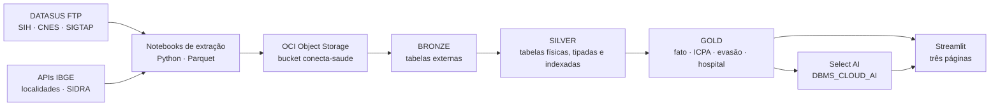

# Conecta Saúde

**Painel de pressão assistencial do SUS** — dos microdados públicos do DATASUS a um índice
municipal comparável, servido por um dashboard que também responde a perguntas em
português.

> Challenge 2026 · Oracle + FIAP
> Fontes: SIH/SUS, CNES, SIGTAP (DATASUS) e IBGE · competências 202401–202412
> Arquitetura: Object Storage → Oracle Autonomous AI Database → Streamlit

---

## Por que o projeto existe

Os dados do SUS são abertos e completos. Ainda assim, a pergunta que um gestor faz —
*onde a rede está apertando?* — não tem resposta pronta em lugar nenhum. O que existe são
microdados de internação em arquivos `.dbc` mensais por estado, um cadastro de leitos em
outro formato, uma tabela de procedimentos em largura fixa e a população num terceiro
serviço. Cada um responde a um pedaço, nenhum responde à pergunta.

E responder por volume não resolve. Um ranking de internações absolutas apenas reordena os
municípios por tamanho: São Paulo aparece sempre em primeiro, e o município pequeno com a
rede saturada some da lista. Pressão assistencial é uma relação entre demanda, capacidade
instalada e tempo de ocupação — três grandezas que vivem em fontes diferentes.

O Conecta Saúde foi idealizado para fechar essa lacuna em três movimentos:

1. **Integrar** as quatro fontes num modelo único, com grão explícito e chaves validadas.
2. **Medir** a pressão com um índice composto e comparável entre municípios — o **ICPA**.
3. **Entregar** o resultado em um painel que um gestor consegue ler, e que aceita pergunta
   em linguagem natural sem que ninguém precise escrever SQL.

O recorte territorial é o município, e isso é decisão de projeto: é nele que a ausência de
serviço aparece. Dos 5.571 municípios brasileiros, boa parte não tem um único leito SUS —
e esse é o achado que um modelo construído a partir dos hospitais apagaria, porque
município sem hospital simplesmente não teria linha.

---

## O ICPA — Índice Composto de Pressão Assistencial

O indicador proprietário do projeto. Uma nota de 0 a 100 por município e competência,
composta por três dimensões, porque pressão assistencial não é uma coisa só:

| Peso | Dimensão | Medida | O que captura |
|---|---|---|---|
| 0,35 | Demanda relativa | Internações de residentes por 10 mil hab. | Quanto a população demanda em relação ao próprio tamanho — separa município grande de município sob pressão |
| 0,40 | Uso da capacidade | Internações por leito SUS | Estresse direto sobre a estrutura que existe; por isso o maior peso |
| 0,25 | Tempo de ocupação | Permanência média | Leito ocupado por mais tempo é leito indisponível — dois municípios com o mesmo giro têm pressões diferentes se a permanência difere |

**Normalização.** Min-max *dentro de cada competência*, para que o índice seja comparável
entre municípios no mesmo mês. O teto é o **percentil 95**, e não o máximo absoluto: sem
esse corte, um único município extremo comprime todos os outros perto de zero e o índice
perde poder de discriminação. Valores acima do p95 recebem 1.

**Faixas.** Baixa (< 20), Moderada (20–40), Alta (40–60), Crítica (≥ 60).

**Exclusões:** Município sem leito SUS ou sem produção hospitalar fica **fora** do índice. Não é pressão baixa: é ausência de serviço, que é outra categoria de problema. Esses municípios são sinalizados pelas colunas `sem_leito_sus` e `sem_producao_hospitalar` e tratados em seção própria do painel — os **vazios assistenciais**, medidos junto com a evasão que eles produzem.

---

## Arquitetura



### As três camadas

| Camada | O que é | Por quê |
|---|---|---|
| **Bronze** | Tabelas externas (`DBMS_CLOUD.CREATE_EXTERNAL_TABLE`) apontando para os Parquet no bucket | Nada é copiado: a leitura acontece no `SELECT`. Serve para conferir a carga sem gastar os 20 GB do plano Always Free |
| **Silver** | Tabelas físicas dentro do banco, com tipos declarados, chaves primárias e índices | Única etapa que copia bytes. Os tipos são declarados, não herdados do Parquet — código vira `VARCHAR2` de tamanho fixo para preservar o zero à esquerda, e população vira `NUMBER`, porque `BINARY_DOUBLE` em contagem de pessoas gera arredondamento nas divisões per capita |
| **Gold** | Fato municipal, ICPA, evasão, hospital, procedimento e rankings — tabelas e views | É o que o dashboard consulta. **Nenhum indicador é calculado em Python**: o app faz `SELECT` e desenha |

O grão de toda a camada Gold é **(município, competência)**. A regra vale para todo JOIN
entre tabelas Gold, que precisa casar `cod_municipio` **e** `competencia` — juntar só pelo
município multiplica as linhas pelas doze competências.

---

## Fontes de dados

| Fonte | Papel no ICPA | O que entra | Volume |
|---|---|---|---|
| **SIH/SUS** (grupo RD) | Numerador — quantas internações aconteceram | 12 competências × 27 UFs, agregadas por atendimento, residência, fluxo, hospital e procedimento | ~12 mi de AIH → 5 agregados |
| **CNES** (grupos LT e ST) | Denominador — quantos leitos existem | Leitos em 12 competências; atributos do estabelecimento em 1 | 594.831 + 445.306 linhas |
| **IBGE** (Localidades + SIDRA) | Denominador populacional e hierarquia territorial | População 2024 e território → município → UF → região | 5.571 municípios |
| **SIGTAP** | Dimensão de significado | Procedimentos, grupos, subgrupos, formas de organização e complexidade | 4.844 procedimentos |

Sem o SIGTAP, o `PROC_REA` do SIH é o número `0303140151` e nada mais. Com ele, é
"tratamento de insuficiência cardíaca", de média complexidade — a diferença entre um painel
que lista códigos e um painel que um gestor consegue ler.

O **dicionário de dados** não é escrito à mão: é gerado por notebook a partir dos Parquet
em disco, com schema real, preenchimento, cardinalidade e domínios observados. Coluna sem
descrição no catálogo aparece na lista de pendências ao final da execução. Um dicionário
digitado começa correto e envelhece em silêncio; este pode ficar incompleto, mas não fica
errado sem avisar.

---

## O painel

Três páginas, com uma barra de filtros comum — competência, região, UF e porte do
município.

### 1 · Visão geral da rede
Panorama antes do diagnóstico. Fita de indicadores com variação contra a competência
anterior, mapa coroplético das 27 UFs por ocupação estimada, internações por região,
leitos por tipo de gestão e a série mensal das doze competências.

### 2 · Indicadores de capacidade
A página que sustenta a tese. Capacidade instalada contra demanda, matriz região × faixa de
pressão, ranking de municípios pelo ICPA, **vazios assistenciais** com a evasão
correspondente, estabelecimentos sob maior giro de leito e deslocamento de pacientes com o
destino principal de cada origem.

### 3 · Assistente Select AI
Pergunta em português; resposta em quatro partes — narrativa do modelo, leitura calculada
sobre as linhas devolvidas, gráfico escolhido pelo formato do resultado e o **SQL gerado,
visível para auditoria**.

A tradução de pergunta em SQL acontece **dentro do Autonomous Database**, via
`DBMS_CLOUD_AI`. O Streamlit não vê o modelo nem a chave: manda a pergunta, recebe o SQL,
confere e executa. O perfil expõe ao modelo **apenas as tabelas da camada Gold** — o que é
segurança e também qualidade, porque quanto menor o esquema apresentado, melhor o SQL
gerado.

---

## Estrutura do repositório

```text
conecta-saude/
├── Fontes de dados/                 
│   ├── extracao_sih_sus_*.ipynb     
│   ├── extracao_cnes_*.ipynb        
│   ├── extracao_ibge_*.ipynb        
│   ├── extracao_sigtap_*.ipynb      
│   ├── dicionario_de_dados_*.ipynb  
│   └── carga_autonomous_database_*.ipynb   
├── sql/                             
│   ├── 00_setup.sql                 
│   ├── 01_bronze.sql                
│   ├── 02_silver.sql                
│   ├── 03_gold.sql                  
│   ├── 04_select_ai.sql             
│   ├── 05_app_user.sql                   
│   └── 06_comentarios_gold.sql      
├── dashboard/                       
│   ├── app.py                       
│   ├── db.py                        
│   ├── ai.py                        
│   ├── ui.py                        
│   ├── views/                       
│   ├── geo/                         
│   └── docs/                        
└── dados/                           
    └── tratado/_dicionario/         
```

> `dados/`, `sql/` e `referencias/` estão listados no `.gitignore`: os dados e os scripts de
> banco são mantidos localmente, fora do controle de versão.

---

## Licença

MIT — ver [LICENSE](LICENSE). Os dados são públicos, produzidos pelo DATASUS / Ministério
da Saúde e pelo IBGE.
