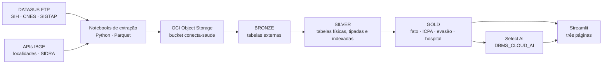

# Conecta Saúde

**Painel de pressão assistencial do SUS** — dos microdados públicos do DATASUS a um índice
municipal comparável, servido por um dashboard que também responde a perguntas em
português.

> Challenge 2026 · Oracle + FIAP
> Fontes: SIH/SUS, CNES, SIGTAP (DATASUS) e IBGE · competências 202401–202412
> Arquitetura: Object Storage → Oracle Autonomous AI Database → Streamlit

---

## Por que o projeto existe

Os dados do SUS são abertos e completos. Ainda assim, a pergunta que um gestor faz —
*onde a rede está apertando?* — não tem resposta pronta em lugar nenhum. O que existe são
microdados de internação em arquivos `.dbc` mensais por estado, um cadastro de leitos em
outro formato, uma tabela de procedimentos em largura fixa e a população num terceiro
serviço. Cada um responde a um pedaço, nenhum responde à pergunta.

E responder por volume não resolve. Um ranking de internações absolutas apenas reordena os
municípios por tamanho: São Paulo aparece sempre em primeiro, e o município pequeno com a
rede saturada some da lista. Pressão assistencial é uma relação entre demanda, capacidade
instalada e tempo de ocupação — três grandezas que vivem em fontes diferentes.

O Conecta Saúde foi idealizado para fechar essa lacuna em três movimentos:

1. **Integrar** as quatro fontes num modelo único, com grão explícito e chaves validadas.
2. **Medir** a pressão com um índice composto e comparável entre municípios — o **ICPA**.
3. **Entregar** o resultado em um painel que um gestor consegue ler, e que aceita pergunta
   em linguagem natural sem que ninguém precise escrever SQL.

O recorte territorial é o município, e isso é decisão de projeto: é nele que a ausência de
serviço aparece. Dos 5.571 municípios brasileiros, boa parte não tem um único leito SUS —
e esse é o achado que um modelo construído a partir dos hospitais apagaria, porque
município sem hospital simplesmente não teria linha.

---

## O ICPA — Índice Composto de Pressão Assistencial

O indicador proprietário do projeto. Uma nota de 0 a 100 por município e competência,
composta por três dimensões, porque pressão assistencial não é uma coisa só:

| Peso | Dimensão | Medida | O que captura |
|---|---|---|---|
| 0,35 | Demanda relativa | Internações de residentes por 10 mil hab. | Quanto a população demanda em relação ao próprio tamanho — separa município grande de município sob pressão |
| 0,40 | Uso da capacidade | Internações por leito SUS | Estresse direto sobre a estrutura que existe; por isso o maior peso |
| 0,25 | Tempo de ocupação | Permanência média | Leito ocupado por mais tempo é leito indisponível — dois municípios com o mesmo giro têm pressões diferentes se a permanência difere |

**Normalização.** Min-max *dentro de cada competência*, para que o índice seja comparável
entre municípios no mesmo mês. O teto é o **percentil 95**, e não o máximo absoluto: sem
esse corte, um único município extremo comprime todos os outros perto de zero e o índice
perde poder de discriminação. Valores acima do p95 recebem 1.

**Faixas.** Baixa (< 20), Moderada (20–40), Alta (40–60), Crítica (≥ 60).

**Exclusões — e por que elas importam.** Município sem leito SUS ou sem produção
hospitalar fica **fora** do índice. Não é pressão baixa: é ausência de serviço, que é outra
categoria de problema. Esses municípios são sinalizados pelas colunas `sem_leito_sus` e
`sem_producao_hospitalar` e tratados em seção própria do painel — os **vazios
assistenciais**, medidos junto com a evasão que eles produzem.

---

## Arquitetura



### As três camadas

| Camada | O que é | Por quê |
|---|---|---|
| **Bronze** | Tabelas externas (`DBMS_CLOUD.CREATE_EXTERNAL_TABLE`) apontando para os Parquet no bucket | Nada é copiado: a leitura acontece no `SELECT`. Serve para conferir a carga sem gastar os 20 GB do plano Always Free |
| **Silver** | Tabelas físicas dentro do banco, com tipos declarados, chaves primárias e índices | Única etapa que copia bytes. Os tipos são declarados, não herdados do Parquet — código vira `VARCHAR2` de tamanho fixo para preservar o zero à esquerda, e população vira `NUMBER`, porque `BINARY_DOUBLE` em contagem de pessoas gera arredondamento nas divisões per capita |
| **Gold** | Fato municipal, ICPA, evasão, hospital, procedimento e rankings — tabelas e views | É o que o dashboard consulta. **Nenhum indicador é calculado em Python**: o app faz `SELECT` e desenha |

O grão de toda a camada Gold é **(município, competência)**. A regra vale para todo JOIN
entre tabelas Gold, que precisa casar `cod_municipio` **e** `competencia` — juntar só pelo
município multiplica as linhas pelas doze competências.

### Decisões que sustentam o modelo

- **A dimensão vem primeiro no FROM.** `gold_fato_municipio` parte dos 5.571 municípios do
  IBGE e traz os fatos por `LEFT JOIN`. Um `INNER JOIN` apagaria do painel exatamente o
  município sem produção hospitalar, que é o achado central do projeto.
- **Dois municípios por internação.** O SIH traz `MUNIC_RES` (onde o paciente mora) e
  `MUNIC_MOV` (onde a internação aconteceu). Confundi-los inverte a conclusão do índice:
  residência cruzada com a população mede **necessidade**; atendimento cruzado com os
  leitos do CNES mede **carga**. A diferença agregada entre os dois é a **evasão
  assistencial**, e é o que faz um município-polo pequeno aparecer com carga altíssima e
  necessidade baixa — precisamente o caso que o índice precisa destacar.
- **Agregar antes de guardar.** O SIH de 2024 são cerca de 12 milhões de linhas e 113
  colunas, algo como 13 GB em memória se concatenado. A extração inverte a ordem: agrega
  arquivo por arquivo e descarta o bruto. O pico de memória passa a ser o de um
  estado-mês, não o do país inteiro — e o conjunto tratado inteiro cabe em ~16 MB de
  Parquet.
- **Todo denominador leva `NULLIF`.** Município sem leito ou sem internação é caso real, e
  o `NULL` resultante significa "não aplicável", que é diferente de zero.

---

## Fontes de dados

| Fonte | Papel no ICPA | O que entra | Volume |
|---|---|---|---|
| **SIH/SUS** (grupo RD) | Numerador — quantas internações aconteceram | 12 competências × 27 UFs, agregadas por atendimento, residência, fluxo, hospital e procedimento | ~12 mi de AIH → 5 agregados |
| **CNES** (grupos LT e ST) | Denominador — quantos leitos existem | Leitos em 12 competências; atributos do estabelecimento em 1 | 594.831 + 445.306 linhas |
| **IBGE** (Localidades + SIDRA) | Denominador populacional e hierarquia territorial | População 2024 e território → município → UF → região | 5.571 municípios |
| **SIGTAP** | Dimensão de significado | Procedimentos, grupos, subgrupos, formas de organização e complexidade | 4.844 procedimentos |

Sem o SIGTAP, o `PROC_REA` do SIH é o número `0303140151` e nada mais. Com ele, é
"tratamento de insuficiência cardíaca", de média complexidade — a diferença entre um painel
que lista códigos e um painel que um gestor consegue ler.

O **dicionário de dados** não é escrito à mão: é gerado por notebook a partir dos Parquet
em disco, com schema real, preenchimento, cardinalidade e domínios observados. Coluna sem
descrição no catálogo aparece na lista de pendências ao final da execução. Um dicionário
digitado começa correto e envelhece em silêncio; este pode ficar incompleto, mas não fica
errado sem avisar.

---

## O painel

Três páginas, com uma barra de filtros comum — competência, região, UF e porte do
município.

### 1 · Visão geral da rede
Panorama antes do diagnóstico. Fita de indicadores com variação contra a competência
anterior, mapa coroplético das 27 UFs por ocupação estimada, internações por região,
leitos por tipo de gestão e a série mensal das doze competências.

### 2 · Indicadores de capacidade
A página que sustenta a tese. Capacidade instalada contra demanda, matriz região × faixa de
pressão, ranking de municípios pelo ICPA, **vazios assistenciais** com a evasão
correspondente, estabelecimentos sob maior giro de leito e deslocamento de pacientes com o
destino principal de cada origem.

### 3 · Assistente Select AI
Pergunta em português; resposta em quatro partes — narrativa do modelo, leitura calculada
sobre as linhas devolvidas, gráfico escolhido pelo formato do resultado e o **SQL gerado,
visível para auditoria**.

A tradução de pergunta em SQL acontece **dentro do Autonomous Database**, via
`DBMS_CLOUD_AI`. O Streamlit não vê o modelo nem a chave: manda a pergunta, recebe o SQL,
confere e executa. O perfil expõe ao modelo **apenas as tabelas da camada Gold** — o que é
segurança e também qualidade, porque quanto menor o esquema apresentado, melhor o SQL
gerado.

**Duas barreiras antes de executar**, independentes de propósito: o SQL passa por uma
verificação de somente-leitura no app (evita mensagem de erro feia na tela) e o usuário da
aplicação tem apenas `SELECT` na Gold (esta é a que de fato protege).

### O que os comentários das tabelas fazem
Com `"comments": "true"` no perfil, o `DBMS_CLOUD_AI` envia os `COMMENT ON` ao modelo junto
do esquema. Não é documentação decorativa. Sem o grão declarado no comentário, perguntado
sobre pressão assistencial o modelo escrevia um JOIN só por `cod_municipio` e devolvia
439.428 linhas onde deveriam sair 3.015 — sem erro e sem vazio, ou seja, **resposta errada
com aparência de certa**. Por isso o grão e a regra de JOIN aparecem no comentário de toda
tabela, e ainda são repetidos no prompt.

### O filtro de competência e a armadilha da soma
Quando o filtro é aberto para o ano inteiro, os volumes viram **média mensal**, nunca soma.
Leito não é grandeza que soma entre meses: os 62 mil leitos de São Paulo em janeiro são os
mesmos de fevereiro, e somá-los daria 750 mil. As razões, escritas como `SUM(a)/SUM(b)`,
não precisam de tratamento — o fator doze aparece nos dois lados e se cancela, e o
resultado já é a média ponderada do período. Contagens de entidade são o caso que engana:
`COUNT(*)` sobre doze meses conta município-mês, não município.

---

## Estrutura do repositório

```text
conecta-saude/
├── Fontes de dados/                 notebooks de extração e carga
│   ├── extracao_sih_sus_*.ipynb     SIH/SUS — internações (numerador)
│   ├── extracao_cnes_*.ipynb        CNES — leitos e estabelecimentos (denominador)
│   ├── extracao_ibge_*.ipynb        IBGE — população e hierarquia territorial
│   ├── extracao_sigtap_*.ipynb      SIGTAP — dimensão de procedimentos
│   ├── dicionario_de_dados_*.ipynb  gerador do dicionário (não escrito à mão)
│   └── carga_autonomous_database_*.ipynb   gera os scripts SQL da carga
├── sql/                             DDL e carga do Autonomous Database
│   ├── 00_setup.sql                 schema, credencial do Object Storage, teste de acesso
│   ├── 01_bronze.sql                tabelas externas sobre os Parquet do bucket
│   ├── 02_silver.sql                tabelas físicas, tipadas, com PK e índices
│   ├── 03_gold.sql                  fato municipal, evasão, hospital e o ICPA
│   ├── 04_select_ai.sql             ACL de rede, credencial do LLM e perfil CONECTA_AI
│   ├── 05_app_user.sql              usuário somente-leitura do dashboard e sinônimos
│   ├── 06_recarga_sih.sql           TRUNCATE + INSERT para reprocessar o SIH
│   └── 07_comentarios_gold.sql      dicionário da Gold que o Select AI lê
├── dashboard/                       aplicação Streamlit
│   ├── app.py                       navegação e estilo compartilhado
│   ├── db.py                        pool de conexão, cache e toda a agregação em SQL
│   ├── ai.py                        Select AI: prompt, barreira de leitura, execução
│   ├── ui.py                        filtros, formatação, gráficos e mapa
│   ├── views/                       as três páginas
│   ├── geo/                         malha das UFs (IBGE), versionada de propósito
│   └── docs/                        identidade visual
└── dados/                           bruto e tratado (local)
    └── tratado/_dicionario/         dicionário gerado
```

> `dados/`, `sql/` e `referencias/` estão listados no `.gitignore`: os dados e os scripts de
> banco são mantidos localmente, fora do controle de versão.

---

## Como reproduzir

### Pré-requisitos
- Python 3.11+
- Uma conta Oracle Cloud — o projeto inteiro cabe no **Always Free**: um Autonomous
  Database e um bucket no Object Storage
- Opcional: chave de API de um provedor de LLM, para o Select AI

### 1 · Extração
Rode os notebooks de `Fontes de dados/` nesta ordem: IBGE, CNES, SIGTAP, SIH e, por último,
o dicionário de dados. Cada um baixa da fonte pública, trata e grava Parquet em
`dados/tratado/`.

```bash
python -m venv .venv
.venv\Scripts\activate
pip install pandas pyarrow datasus-dbc dbfread jupyterlab
```

### 2 · Object Storage
Suba `dados/tratado/` para o bucket espelhando a estrutura de prefixos esperada pelo
`01_bronze.sql`: `bronze/cnes/`, `bronze/ibge/`, `bronze/sigtap/`, `silver/sih/` e
`silver/cnes/`.

### 3 · Banco
Execute os scripts de `sql/` **em ordem e bloco a bloco** — não o arquivo inteiro de uma
vez. Cada um traz no cabeçalho o que esperar, incluindo os erros normais (os `DROP` falham
na primeira execução, por exemplo) e as consultas de validação, que conferem contagem de
linhas e integridade referencial.

O `00_setup.sql` e o `05_app_user.sql` precisam de **duas sessões**: parte como `ADMIN`,
parte como `CONECTA`. Não dá para trocar de usuário no meio de um script — a conexão é
estabelecida no login e vale até o logout.

### 4 · Dashboard

```bash
pip install streamlit oracledb pandas altair pydeck
streamlit run dashboard/app.py
```

As credenciais ficam em `dashboard/.streamlit/secrets.toml`, fora do controle de versão:

```toml
DB_USER = "pulso_app"
DB_PASS = "..."
DB_DSN  = "..."
```

O app conecta com o usuário `pulso_app`, que tem apenas `SELECT` na camada Gold. Isso não é
formalidade: as credenciais vivem no painel do Streamlit Cloud e, se vazarem, o estrago é
alguém ler dado público do DATASUS — não derrubar o banco na véspera da entrega.

A conexão usa pool com `@st.cache_resource`, porque o Streamlit reexecuta o script inteiro a
cada interação e o Always Free aceita no máximo 20 sessões simultâneas. As consultas são
cacheadas com TTL de uma hora — os dados são batch e não mudam entre execuções.

### Reprocessar o SIH
Substitua os Parquet no bucket e rode `06_recarga_sih.sql`, depois **todo** o `03_gold.sql`.
A Gold não pode ser remendada município a município: o ICPA normaliza com
`PERCENTILE_CONT(0.95)` particionado por competência, então entrar com um estado inteiro
desloca o teto do mês e muda o índice de todos os municípios daquela competência.

---

## Notas de escopo e limitações

- **Ocupação estimada** é aproximação: dias de permanência sobre dias-leito do mês
  (leitos × 30). O SIH não informa data exata de ocupação.
- A **matriz de pressão** usa faixa do ICPA por região. A versão por especialidade de leito
  exigiria `TP_LEITO` preservado na Silver, que a extração atual agrega antes de gravar.
- O **Select AI depende de provedor externo** de LLM, que não está incluído no Always Free.
  O `04_select_ai.sql` traz o perfil configurado para OpenAI; trocar de provedor é editar o
  atributo `provider` e a ACL de rede. Sem provedor, as duas páginas de painel continuam
  funcionando por inteiro.
- Recorte temporal: **2024 completo**, de 202401 a 202412. O modelo é dimensionado por
  competência, então ampliar o período é acrescentar arquivos, não redesenhar o esquema.
- O SIH usa apenas o grupo **RD** (AIH reduzida). Os grupos SP, ER e RJ ficam fora do MVP.

---

## Licença

MIT — ver [LICENSE](LICENSE). Os dados são públicos, produzidos pelo DATASUS / Ministério
da Saúde e pelo IBGE.
